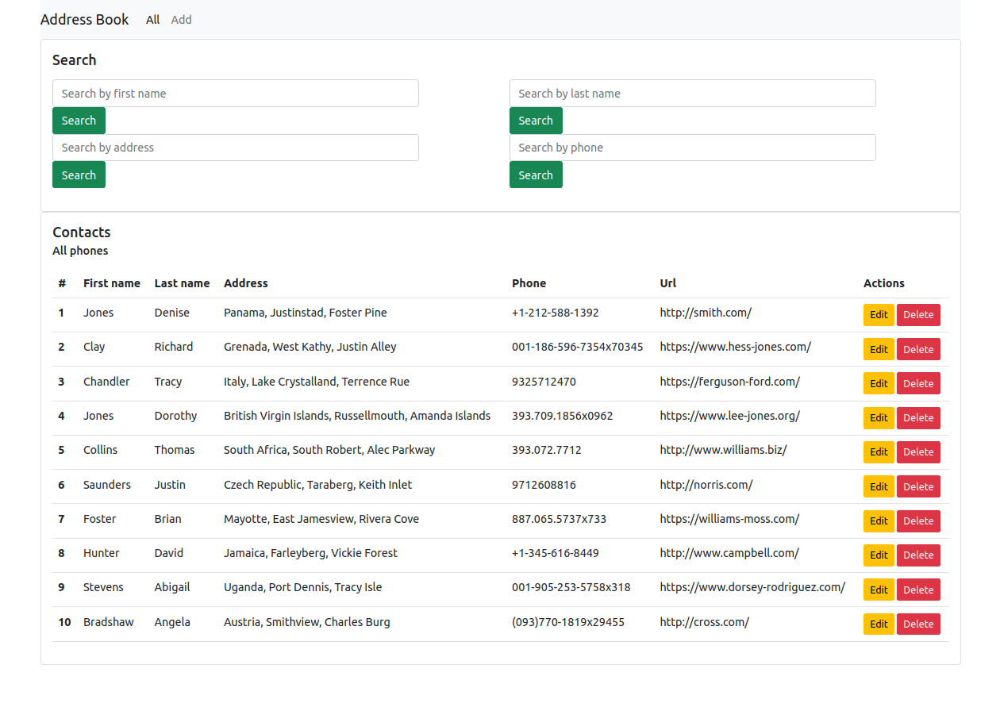

## Description

This is a simple Address Book Application to store contacts and manipulate them




## Install 

1. clone project and cd to project dir
1. create venv and activate it
    ```zsh
    #linux/mac
    python3 -m venv env
    source ./env/bin/activate
    ```
    ```bash
    #win cmd
    python -m venv env
    .\env\Scripts\activate
    ```
1. Install dependensies:
    ```zsh
    pip install -r requirements.txt
    ```

## Run it

1. cd to `src` directory
1. run
    ```zsh
    #linux/mac
    python3 manage.py runserver
    ```
    ```bash
    #win cmd
    python manage.py runserver
    ```